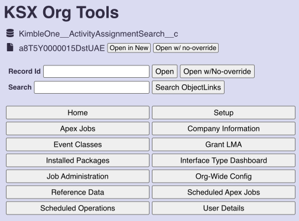
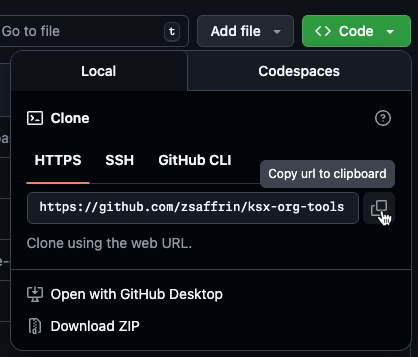
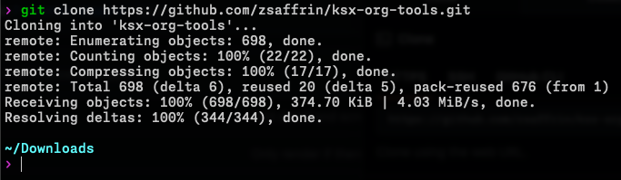
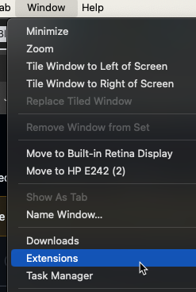
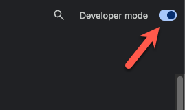
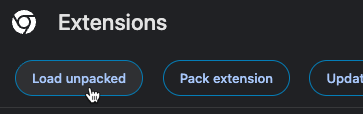
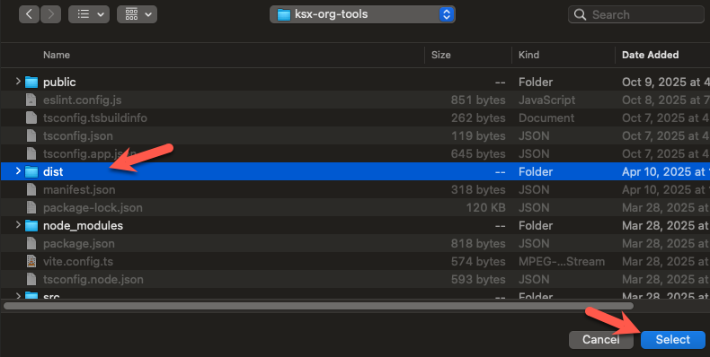
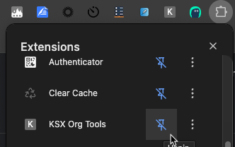
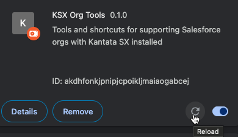

# KSX Org Tools

A simple Google Chrome browser extension for common shortcuts in a Salesforce org with Kantata SX installed.

This extension does not require authentication, permissions, or API access, nor does it access, store, or modify any data directly in the org. Its functions and shortcuts are standardized and information is parsed solely from the current displayed page address.

This extension assumes you are operating as a System Administrator user on behalf of Kantata and that you otherwise have access to and responsible knowledge of the areas of the system to which this extension provides shortcuts.

**You are entirely responsible for anything you do or access using this tool**. If you aren't an employee of Kantata and your supervisor has not directly instructed you in the use of this tool, do not use it.

## Usage

Simply open the extension while on a tab logged into a Salesforce org with Kantata SX installed.

This currently only works in Google Chrome browser

## Installation

**Prerequisite**: You will need to have Git installed on your machine

On a Mac, Git comes included in the Apple XCode Command-Line Tools. Install them:

1. Open the Terminal
2. Run `xcode-select --install`

Note that this might take some time to complete

On a PC, follow the steps for the [Git For Windows](https://gitforwindows.org/) package installer

### 1. Check out the git repo

Use the "**<> Code**" button above, and on the "HTTPS" tab under the Local > Clone section, copy the https url to your clipboard.

In your terminal, navigate to the folder where you want to store the repository. Then run `git clone ` and paste the copied url.

### 2. Install the extension

a. Open Chrome browser, and from the **Window** menu open the **Extensions** page.

b. In the top-right corner, enable the toggle titled **Developer Mode**

c. Click the **Load Unpacked** button.

d. Navigate to where you installed the repo and select the `/dist` folder

e. Pin the extension, so it shows in your toolbar

## Updating

To update to the latest version:

1. In your terminal, navigate to the root repo folder
2. Run `git pull`
3. Restart Chrome browser, or on the Extensions page click the **Reload** icon

